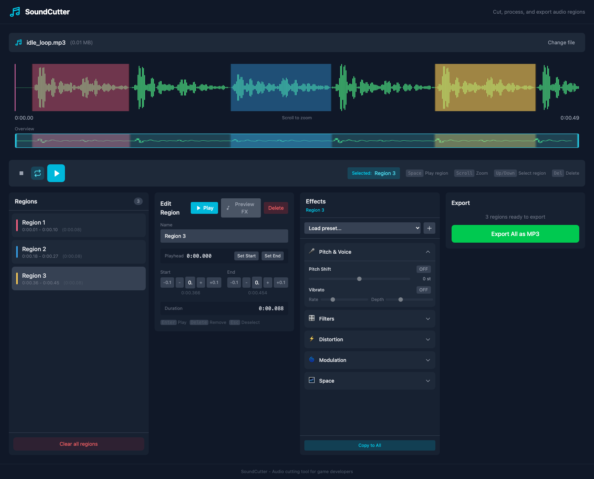

# SoundCutter

SoundCutter is a browser-based audio cutter and voice effects tool built with SvelteKit, WaveSurfer.js, Tone.js, and FFmpeg.wasm. You can upload or record audio, create regions, preview per-region effects, and export each region as MP3 or as a ZIP bundle.



## Features
- Upload MP3, WAV, OGG, and AIFF files
- Record audio directly from the microphone
- Create, rename, trim, and keyboard-navigate waveform regions
- Apply per-region effects and presets with live preview
- Export all regions as 192 kbps MP3 files
- Download exports individually or as a ZIP archive

## Privacy and Data Handling
- Audio processing happens locally in the browser.
- User-created presets are stored in `localStorage`.
- No server upload flow is built into this app.
- The FFmpeg core bundle is downloaded on demand from `https://unpkg.com/@ffmpeg/core@0.12.6/dist/esm` the first time you export or convert AIFF audio.

## Supported Browsers
- Best supported: current desktop Chromium-based browsers
- Expected to work: current Firefox and Safari, but they are not the primary validation target
- Microphone recording requires a browser with `MediaRecorder` and `getUserMedia` support

## Tooling
- Node.js `22.12.0` or newer
- pnpm `10.21.0`

## Development
```sh
pnpm install
pnpm check
pnpm test
pnpm build
pnpm dev
```

## Usage
1. Upload an audio file or record a voice clip.
2. Drag on the waveform to create one or more regions.
3. Select a region to rename it, adjust timing, and apply effects or presets.
4. Preview dry playback or effect playback.
5. Export all regions and download the MP3 files individually or as a ZIP.

## Deployment Note
This repository is a public app source repo, not a published npm package. If you deploy it, make sure your host serves the app with the cross-origin isolation headers required by FFmpeg.wasm:

- `Cross-Origin-Embedder-Policy: require-corp`
- `Cross-Origin-Opener-Policy: same-origin`

The local Vite dev server already sets these headers.

## Project Files
- `src/lib/components` contains the UI
- `src/lib/audio/ToneEffects.ts` contains the active effects engine
- `src/lib/stores` contains app state
- `.github/workflows/ci.yml` runs the release checks

## License
- Project license: MIT. See `LICENSE`.
- Third-party dependency licenses: `THIRD_PARTY_LICENSES.md`.
