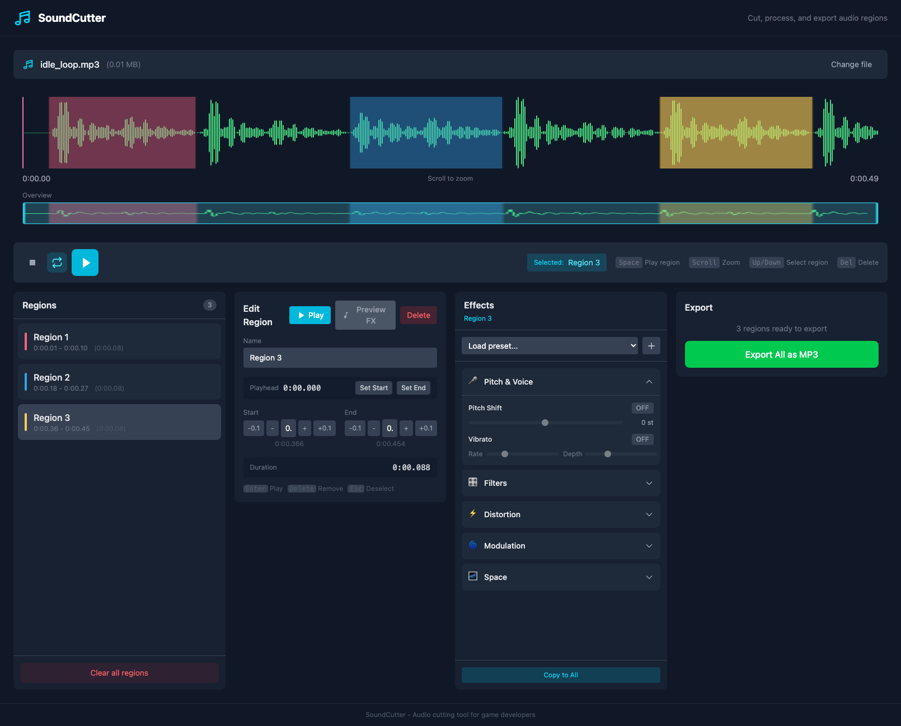

# Gaijin World MP3 Splitter

Browser-local MP3 splitter built with SvelteKit (Svelte 5), WaveSurfer.js, and FFmpeg.wasm. Load an MP3, drop ordered split points on the waveform, and export the contiguous segments — losslessly (stream copy) or precisely (re-encode) — as individual files or a ZIP bundle. No server upload; all processing happens in the browser.



## Features
- Open an MP3 file and see its waveform instantly
- Add ordered split points (button, `S` key, or click); contiguous segments are derived automatically
- Select/edit/delete points with millisecond `H:MM:SS.mmm` precision
- Keyboard workflow: `Space` play/pause, `S` add point, `Delete`/`Backspace` remove, `←`/`→` seek, `Shift+←`/`→` coarse seek
- Enable/disable individual segments before export
- Two cut modes: **Fast/Lossless** (`-c:a copy`, no re-encode) and **Precise** (`libmp3lame -q:a 2` re-encode for frame-exact boundaries)
- Sequential batch export with per-segment progress and cancellation
- Download parts individually (`*_part_001.mp3` …) or as a ZIP
- Responsive layout; 250 MB+ input size warning
- Visible version badge (`vYYYY.MM.DD.NN`) in the header and page title

## Privacy and Data Handling
- Audio processing happens locally in the browser.
- No server upload flow is built into this app.
- The FFmpeg core bundle is downloaded on demand from `https://unpkg.com/@ffmpeg/core@0.12.6/dist/esm` the first time you split. Override with `VITE_FFMPEG_CORE_BASE_URL` to self-host (see `static/ffmpeg/README.md`; production self-hosting is tracked in issue #12).

## Supported Browsers
- Best supported: current desktop Chromium-based browsers
- Expected to work: current Firefox and Safari

## Tooling
- Node.js `22.12.0` or newer
- pnpm `10.21.0`

## Development
```sh
pnpm install
pnpm check
pnpm test
pnpm build
pnpm dev
```

## Usage
1. Open an MP3 file.
2. Add split points on the waveform or via the playback bar (`S`, or Add Split Point).
3. Edit point times to millisecond precision in the segment table; toggle segments on/off.
4. Choose Fast/Lossless or Precise mode, then Start Splitting.
5. Download each MP3 part individually or use Download All ZIP.

## Version and Releases
- Version format: `YYYY.MM.DD.NN` (date + daily increment), e.g. `2026.10.06.01`.
- Single source for the displayed version: `src/lib/version.ts` (`APP_VERSION`). The deployed version may be overridden at runtime by `window.MP3SPLITTER_RUNTIME_CONFIG.visibleVersion`, injected by the WordPress plugin.
- On a release bump, keep in sync: `APP_VERSION` in `src/lib/version.ts`, the `<title>` in `src/app.html`, `MP3S_PLUGIN_VERSION` + the `Version:` header in `wordpress/mp3-splitter-v1/mp3-splitter-v1.php`, and `visibleVersion`/`buildDate` in `wordpress/mp3-splitter-v1/runtime-contract.json`.
- Bump work happens on `chore/version-bump-<version>` branches.

## WordPress (LocalWP) Deployment
The app ships as an SPA (`@sveltejs/adapter-static`, `index.html` fallback) embeddable in WordPress via the `mp3-splitter-v1` plugin in `wordpress/`:

```sh
pnpm deploy:localwp
```

This builds with `SVELTEKIT_PATHS_BASE=/wp-content/plugins/mp3-splitter-v1/assets/dist` and copies the plugin (`mp3-splitter-v1.php`, `runtime-contract.json`, `assets/dist/`) into the local site at `%USERPROFILE%\Local Sites\gaijinworld-local\app\public` (override with `LOCALWP_PUBLIC_DIR`). Activating the plugin self-installs the `/mp3-splitter/` page containing the `[mp3_splitter]` shortcode; the plugin injects `window.MP3SPLITTER_RUNTIME_CONFIG` (including `visibleVersion`) into the page.

## Recent Changes
- **2026-10-06** — `e607a0c` chore: remove legacy Tone/Region/Voice modules and tone dependency (#14)
- **2026-10-06** — `34766ad` Phase 2: define Electron desktop target and native FFmpeg architecture (#9)
- **2026-10-06** — `46f42b7` Phase 1.1: add Fast/Lossless and Precise MP3 cut modes (#8)
- **2026-10-06** — `c2aacf3` Phase 1F/1G: harden responsive UI, QA and split tests (#7)
- **2026-10-06** — `96e4a85` Phase 1E: add batch export, ZIP, progress and cancellation (#6)
- **2026-10-06** — `bef3dcf` Phase 1D: add lossless FFmpeg.wasm split engine (#5)
- **2026-10-06** — `74d2c8d` Phase 1C: replace regions with waveform split markers (#4)
- **2026-10-06** — `4978982` Phase 1B: remodel UI into MP4Splitter-style workspace (#3)
- **2026-10-06** — `8fbe0aa` Phase 1A: add ordered split model and millisecond timecode (#10)
- **2026-10-06** — `405c2e7` docs: establish MP3 Splitter refactor baseline (#1)
- **2026-09-04** — `2f1d4cf` release: prepare public open source repo

## Deployment Note
This repository is a public app source repo, not a published npm package. FFmpeg.wasm's single-threaded core works without cross-origin isolation; if you switch to a multithreaded core, your host must serve the app with:

- `Cross-Origin-Embedder-Policy: require-corp`
- `Cross-Origin-Opener-Policy: same-origin`

The local Vite dev server already sets these headers.

## Project Files
- `src/lib/components` contains the UI (PlaybackBar, SplitPointsTable, SplitButton, WaveformDisplay, AudioUploader)
- `src/lib/stores` contains app state (`splitStore` owns split points and derived segments)
- `src/lib/media` contains the `MediaSplitEngine` contract and `BrowserFfmpegEngine`
- `wordpress/mp3-splitter-v1` contains the WordPress plugin wrapper for LocalWP deploys
- `docs/phases` documents the phased refactor (00 → 02)
- `.github/workflows/ci.yml` runs the release checks

## License
- Project license: MIT. See `LICENSE`.
- Third-party dependency licenses: `THIRD_PARTY_LICENSES.md`.
